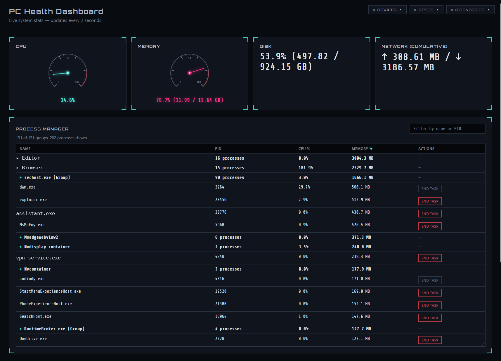

# PC Health Dashboard

A local, Windows 11-focused replacement for Task Manager that doesn't just
show you numbers — it explains what your machine is actually doing and why,
so you can understand and optimize Windows instead of switching to Linux to
feel in control of your own PC.

**Status: v1 — feature-complete and daily-driver ready.**

## Why this exists

Windows 11 ships with a fair amount of background noise, and Task Manager
shows you raw data without much explanation. "Why is my memory full when I
only have one YouTube tab open?" isn't answerable from Task Manager alone —
this tool exists to answer questions like that directly, by grouping
processes into real applications, explaining what's running at startup and
why, and surfacing plain-English diagnoses instead of just numbers.

## Screenshots



## Features

**Live system overview**
- Real-time CPU, memory, disk, and network stats with gauge-style dials
- A collapsible Diagnostics panel that explains *why* the system is under
  load right now (CPU dominance, memory pressure, disk-bound activity),
  naming the specific process responsible rather than just flagging a number
- A collapsible Specs panel showing static hardware info (CPU, RAM, GPU,
  storage, motherboard, OS) — queried once and cached, since it doesn't change
- A collapsible Devices panel listing connected USB peripherals, keyboards,
  and displays, with built-in vs. external labeling where Windows reliably
  exposes it

**Process Manager** (a genuine Task Manager alternative)
- Every running process, grouped by parent-child relationship into real
  applications instead of a flat list of anonymous PIDs — a browser with 16
  child processes shows as one collapsible "Firefox" row with a real total,
  expandable to see each process's role (GPU Process, Tab Content Process,
  Extension Host, etc.)
- Sortable columns (name, CPU%, memory), live search/filter
- "End Task" process termination, with a hardcoded list of protected system
  processes that can never be terminated through the app, individual-process
  scope only (never a whole group at once), a confirmation step showing
  exactly what will be terminated, graceful-then-forceful termination, and
  a local action log

**Startup & Services Audit**
- Every program registered to run at startup (Startup folder, registry
  Run/RunOnce keys) and every Windows service, in one searchable, sortable
  table
- Plain-English descriptions and impact ratings for recognized software —
  and honest silence (no fabricated guess) for anything unrecognized
- Orphaned entry detection — flags startup entries pointing at software
  that's since been uninstalled, with a clear "safe to remove" note
- True enabled/disabled state — reads the same `StartupApproved` registry
  flag Task Manager's own "Disable" button writes to, rather than just
  checking whether the underlying registry key exists (which Task
  Manager's disable does *not* remove)

**Daily usability**
- Resizable panels, so you control how much of each table is visible at once
- Single-instance enforcement — accidentally launching the app twice is a
  harmless no-op, not a resource-competing duplicate
- A one-click launcher (`launch.vbs`) that starts the app with no visible
  console window and opens your browser — no terminal or IDE required

## Getting started

**Option 1 — one-click launcher (recommended for daily use)**

Double-click `launch.vbs`. It starts the server in the background and opens
your browser to the dashboard. Running it again while already running just
opens/focuses the browser — safe to click as many times as you want.

Pin `launch.vbs`'s shortcut to your Windows taskbar for one-click access.
Once the dashboard's open, use Firefox/Chrome's "Pin Tab" so it stays in
your tab bar too.

**Option 2 — manual (for development)**
```bash
python -m venv .venv
.venv\Scripts\activate
pip install -r requirements.txt
python -m src.main
```
Then open http://localhost:8000

## How it works

- **`src/collectors/`** — all system data gathering lives here, independent
  of the API/UI, and is unit-tested with mocked `psutil`/`wmi` calls rather
  than requiring real system access:
  - `system_stats.py` — live CPU/RAM/disk/network via `psutil`
  - `startup_audit.py` — startup/service audit, orphan detection, true
    `StartupApproved` state
  - `known_software.py` — plain-English descriptions/impact for recognized
    startup software, honest fallback for unrecognized
  - `process_list.py` — process enumeration, grouping (union-find on
    parent-child + shared-name fallback), role labeling via command-line
    parsing, live CPU/memory
  - `process_control.py` — process termination: protected-process list,
    graceful-then-forceful termination, action logging
  - `diagnostics.py` — rules-based "why is it slow" signatures
  - `system_specs.py` — static hardware/OS specs, cached once
  - `device_inventory.py` — connected USB devices, keyboards, displays
  - `known_devices.py` — plain-English device categorization
- **`src/api/server.py`** — thin FastAPI routes; each one calls a collector
  and shapes the response, no business logic in the routes themselves
- **`src/web/`** — a dependency-light frontend (HTML/CSS/vanilla JS +
  Chart.js), styled with an intentional "cyberpunk exposed-mechanism"
  visual identity — the idea being that the UI itself should feel like
  looking at the machine's exposed inner workings, not a generic dashboard

## Safety & privacy

- **Read-only by default.** Nothing modifies the registry, deletes files,
  disables services, or uninstalls software.
- **Process termination is the one exception**, and it's deliberately
  guardrailed: a hardcoded list of protected system processes that can
  never be terminated, individual-process scope only, explicit confirmation
  before acting, and every attempt logged locally.
- **Fully local.** No telemetry, no external calls, no data leaves your
  machine. All system data is read live at runtime — nothing about your
  specific installed software or hardware is stored in this repository;
  cloning it gives you the same empty tool, which only shows real data once
  you run it on your own machine.

## Known limitations

- The Devices panel can occasionally return empty results under heavy
  concurrent load, since its WMI queries compete with the live-polling
  endpoints for server thread availability. A timeout-cleanup bug was fixed,
  but the underlying contention is an accepted tradeoff for now, not fully
  eliminated.
- CPU% will not exactly match Task Manager's number. Task Manager (Windows
  10+) reports a "CPU utility" metric that factors in processor frequency
  scaling; this tool reports the more standard raw busy-time metric that
  `psutil` and most cross-platform tools use. Both are accurate, they're
  just answering slightly different questions.
- USB port type (A vs. C) isn't reported — Windows doesn't reliably expose
  this at the OS level, so it's honestly omitted rather than guessed.
- CPU/GPU temperature isn't included — there's no standard Windows API for
  this without either administrator privileges or a vendor-specific SDK,
  which felt like the wrong tradeoff for v1.

## Roadmap — what's likely coming in v2

- Correlating startup/service audit entries with their live running process,
  so the audit table shows real-time CPU/memory next to each entry instead
  of just a static impact estimate
- A "top resource offenders" leaderboard, sampled over a rolling window
- Broader background-noise classification, extending the known-software
  concept to categorize *all* running processes, not just startup items
- Safe, reversible startup/service management (enable/disable) directly
  from the app — deliberately scoped and guardrailed the same way process
  termination was
- An overall "optimization score" synthesizing the diagnostic engine's
  findings
- Historical trend tracking, a disk space treemap, and a Scheduled Tasks
  audit
- Optional CPU/GPU temperature support (would require deciding on an
  admin-elevation or vendor-SDK tradeoff)

## Tech stack

Python 3.11+, FastAPI, `psutil`, `pywin32`/`wmi`, Chart.js, vanilla JS/CSS
(no frontend build step).

## License

MIT — see [LICENSE](LICENSE).
